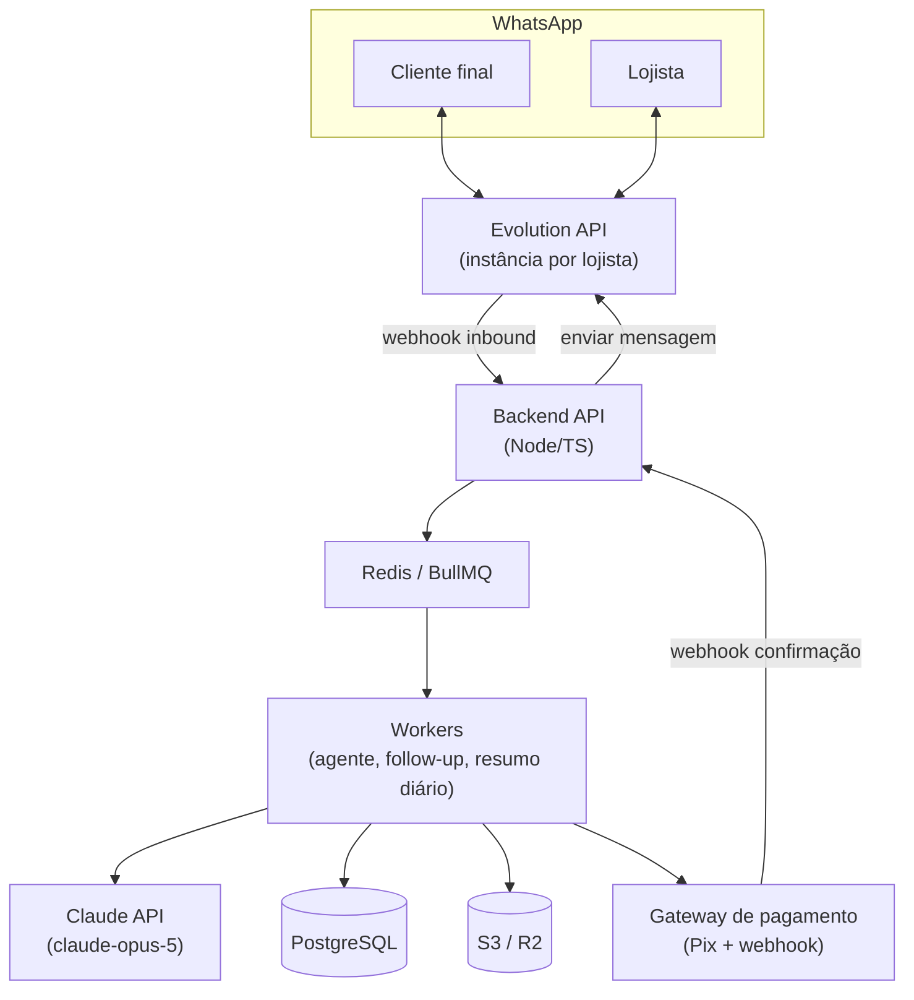
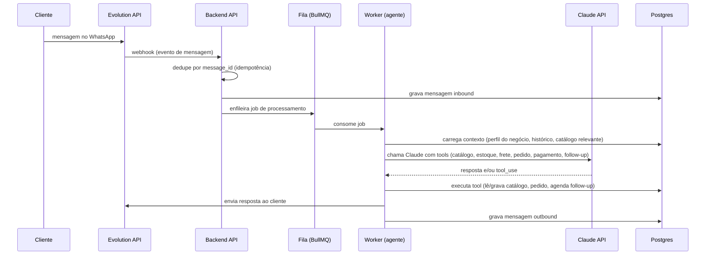
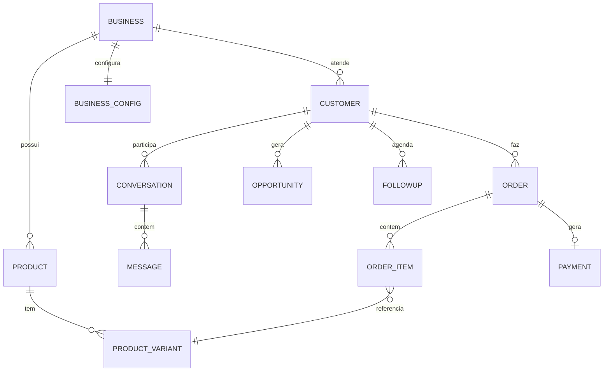

# Arquitetura técnica — Vendedor IA

> Baseado no PRD v0.1 (link no README). Este documento cobre a fase **01 — MVP automatizado** do roadmap: onboarding conversacional, atendimento, venda guiada e follow-up rodando de ponta a ponta em um número real de WhatsApp.
>
> Implementação em andamento em [`../backend`](../backend) (FastAPI/Python) — ver o README de lá para rodar.

## Decisões de stack

| Decisão | Escolha | Motivo |
|---|---|---|
| Canal WhatsApp | **Evolution API** (self-hosted, sobre Baileys/WhatsApp Web) | Zero custo por mensagem, setup em minutos — prioridade é validar o produto rápido. Risco aceito: não é API oficial, número pode ser banido em uso abusivo/alto volume. Migração para Meta Cloud API fica como caminho de saída quando o volume justificar. |
| Backend | **Python / FastAPI** (async) | Trocado de Node.js para Python por preferência do time. Evolution API continua sendo um serviço HTTP separado — o backend só fala com ele por REST/webhook, então a troca de linguagem não afeta essa fronteira. SQLAlchemy 2.0 async + Alembic para banco, `arq` (Redis) para filas/agendamento no lugar do BullMQ. |
| LLM | **Claude API (Anthropic)**, modelo `claude-opus-5`, SDK oficial `anthropic` | Motor de raciocínio do agente de vendas — é a peça mais exigente do sistema (segue catálogo estruturado, decide quando fazer follow-up, classifica oportunidade). Loop de tool use implementado manualmente (não o Tool Runner do SDK), porque o histórico da conversa vive no Postgres e cada turno roda dentro de um job de worker — precisa de controle explícito sobre contexto e persistência. Ajuste de custo por rota (ex.: modelo mais barato para tarefas simples) é uma decisão de otimização para depois da validação, não do desenho inicial. |
| Banco principal | **PostgreSQL** | Dados relacionais com integridade forte (pedidos, pagamentos, estoque) — não é o tipo de dado que se quer eventual-consistency. |
| Fila / jobs | **Redis + `arq`** | Desacopla recebimento de mensagem do processamento, dá retry automático, e é o mecanismo natural para agendar follow-up ("retomar em 2 dias") e o resumo matinal (job de cron). Equivalente Python ao BullMQ, nativamente assíncrono (combina bem com FastAPI). |
| Storage de mídia | **S3-compatible (Cloudflare R2)** | Fotos de catálogo e mídia trocada na conversa. Ainda não implementado no backend inicial. |
| Pagamento | **Gateway com Pix + webhook** (Asaas, Pagar.me ou Mercado Pago — a decidir) | Requisito não-negociável do PRD: confirmação só pelo webhook do gateway, nunca autodeclaração. No código atual, `generate_payment_link` é um stub — ver README do backend. |

## Visão geral dos componentes



## Fluxo de uma mensagem



## Backend: módulos

- **Ingestão de webhooks** — recebe eventos do Evolution API (mensagem recebida, status de entrega, `fromMe` para detectar intervenção manual do lojista). Idempotente por `message_id` externo.
- **Orquestrador de conversa (agente)** — um loop por conversa que chama o Claude com tool use. Roda no worker, não no request HTTP (mensagens de WhatsApp não têm SLA de resposta síncrona).
- **Serviço de catálogo** — fonte de verdade de produto/preço/estoque/variação. O agente **nunca** responde preço/estoque de memória — sempre via tool `lookup_product` / `check_stock`, que consulta o Postgres diretamente. É o requisito não-negociável do PRD (seção 08).
- **Serviço de pedido** — registra item, calcula frete, gera cobrança.
- **Serviço de pagamento** — gera link/QR Pix, recebe webhook do gateway, é a única fonte de verdade sobre confirmação.
- **Motor de follow-up** — quando o agente identifica "vou pensar" (ou equivalente), chama a tool `schedule_followup(customer_id, prazo, contexto)`. Isso cria um job atrasado no BullMQ; ao disparar, um worker retoma a conversa reusando o agente com o contexto salvo.
- **Motor de oportunidades** — não é um job de IA separado. O próprio agente, durante a conversa, chama `mark_opportunity(customer_id, status, motivo)` (🔴 orçamento sem compra / 🟡 sumiu / 🟢 janela de recompra) no momento em que o padrão acontece. Isso vira uma tabela `opportunities` consultada por um job diário (cron) que monta o resumo matinal do lojista. Mantém a classificação simples e auditável no MVP; "aprendida por negócio" (pergunta em aberto do PRD) fica para quando houver dado suficiente.
- **Resumo diário** — cron por lojista (horário configurável), agrega `opportunities` abertas, envia mensagem formatada com os grupos 🔴🟡🟢 e um atalho ("responda 1 para eu cuidar automaticamente" — WhatsApp via Baileys não garante botão interativo estável, texto com resposta numérica é o fallback confiável).
- **Onboarding** — mesma infraestrutura de agente, com um prompt/tools diferentes (`set_business_hours`, `set_delivery`, `set_payment_methods`) até o perfil do negócio ficar completo.

## Handoff humano (specific do self-hosted)

Como o Evolution API controla o próprio número de WhatsApp do lojista via WhatsApp Web, uma mensagem que o lojista manda **manualmente pelo celular** nessa conversa chega ao nosso backend como evento `fromMe` que não passou pelo nosso `send`. Isso dá um sinal de handoff nativo, sem precisar de comando algum: ao detectar `fromMe` não originado pelo sistema, a IA pausa automaticamente naquela conversa por um cooldown configurável (ex. 6h) até o lojista retomar ou o cliente enviar algo novo. É mais simples que o "assumir conversa" explícito do PRD e nasce de graça da escolha de Evolution API — vale validar se resolve bem o caso de uso antes de construir um comando manual.

## Modelo de dados (núcleo)



Campos-chave a destacar:
- `product_variant`: preço, estoque e combinação tamanho/cor — é o que as tools de catálogo leem, nunca o modelo "sabe" isso.
- `payment.status`: só muda via webhook do gateway, nunca por escrita direta de outro serviço.
- `opportunity.status`: enum `quoted_no_purchase | vanished | repurchase_window | resolved`, criado pela tool `mark_opportunity`.
- Tudo com `business_id` — multi-tenant desde o início, um único backend atende N lojistas.

## Infraestrutura — fase MVP

Um único VPS com Docker Compose é suficiente para validar com as primeiras lojas piloto — é o que está em [`../docker-compose.yml`](../docker-compose.yml):

```
docker-compose.yml
├── evolution-api      # gateway WhatsApp (uma instância por lojista)
├── api                # FastAPI — recebe webhooks, serve /health
├── worker              # arq — processa fila (agente, follow-up, resumo diário)
├── postgres
└── redis
```

Falta ainda no compose (não bloqueia rodar localmente, mas falta para produção): TLS/reverse proxy na frente do endpoint de webhook (ex. Caddy) e migração automática (`alembic upgrade head`) no boot do container `api`.

Caminho de evolução (não faz parte do MVP, mas orienta decisões de agora): separar `worker` em serviço escalável horizontalmente quando o volume de mensagens crescer; migrar Postgres/Redis para gerenciados; considerar Meta Cloud API oficial quando o custo por conversa compensar frente ao risco de ban do número self-hosted.

## Segurança e confiabilidade — pontos não-negociáveis (do PRD)

1. **Nunca alucinar preço/estoque** — resposta do agente sobre produto passa obrigatoriamente por tool call ao catálogo estruturado.
2. **Pagamento confirmado só por webhook do gateway** — nenhum outro caminho marca `payment.status = confirmed`.
3. **Idempotência em todo webhook externo** (WhatsApp e gateway de pagamento) — eventos podem chegar duplicados.
4. **Isolamento por `business_id`** em toda query — é multi-tenant desde a primeira linha de código.

## Em aberto (carregado do PRD, seção 13, com proposta inicial)

| Questão | Proposta para o MVP |
|---|---|
| Ingestão de catálogo | Começar por planilha (CSV/Excel importável) — menor esforço de engenharia e testável já na fase concierge. Extração por foto com IA vision fica como segunda iteração. |
| Autonomia da IA em follow-up/promoção | Autonomia total desde o início no MVP, com o handoff por `fromMe` como rede de segurança — revisar depois do piloto se precisa de aprovação prévia. |
| Modelo de cobrança | Fora do escopo desta arquitetura; depende de custo real medido no piloto (Evolution API é grátis, então o custo variável é majoritariamente Claude API). |
| Múltiplos atendentes no mesmo número | Fora de escopo v1 — o handoff por `fromMe` cobre "dona + funcionária" de forma implícita, mas não distingue quem entre os dois assumiu. |
| Critério de classificação de oportunidade | Regra fixa, decidida pelo próprio agente via `mark_opportunity` durante a conversa (ver seção "Motor de oportunidades" acima). |

## Próximos passos

1. ~~Bootstrap do repositório~~ — feito: `docker-compose.yml`, backend FastAPI/Python, schema Postgres inicial (SQLAlchemy + Alembic), tools do agente (`lookup_product`, `check_stock`, `calculate_shipping`, `create_order`, `generate_payment_link`, `schedule_followup`, `mark_opportunity`) e system prompt. Ver [`../backend`](../backend).
2. Subir uma instância real do Evolution API e ajustar `parse_inbound_message` (`backend/app/services/evolution_client.py`) contra o payload real — o parser atual foi escrito a partir da documentação, não testado contra uma instância viva.
3. Escolher o gateway de pagamento (Asaas/Pagar.me/Mercado Pago) e substituir o stub em `generate_payment_link` — impacta o schema de `payment` e o formato do webhook de confirmação.
4. Validar se o envio "para si mesmo" (resumo diário ao lojista via `owner_wa_id`) funciona no Evolution API/Baileys — é uma lacuna de desenho ainda não resolvida (ver tabela de stacks acima).
5. Testar o fluxo de ponta a ponta (mensagem real → agente → tool call → resposta) com uma loja piloto.
